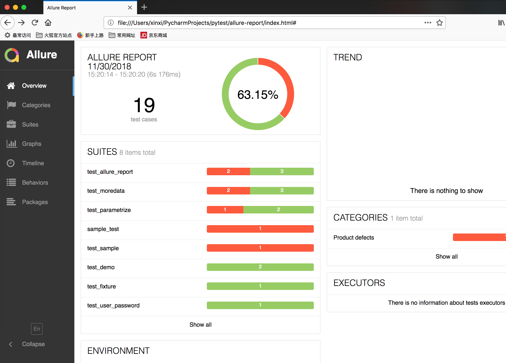

# 简介
pytest框架学习笔记
https://docs.pytest.org/en/latest/fixture.html#pytest-fixtures-explicit-modular-scalable

# 安装
```
pip install pytest
pip install pytest-allure-adaptor
```

# allure报告
```angular2html
命令:
py.test --alluredir=reports
allure generate reports

用火狐浏览器打开,chrome会404
```



# 学习笔记
```
http://www.testclass.net/pytest/fixture/

pytest测试框架中的setup和tearDown

https://python012.github.io/2018/05/08/pytest测试框架中的setup和tearDown/

allure报告

https://blog.csdn.net/liuchunming033/article/details/79624474

https://www.jianshu.com/p/cf64ff553cdb
```